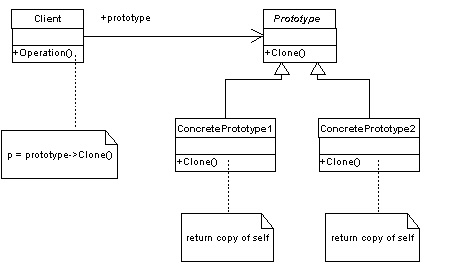

## Prototype pattern
The Prototype pattern creates new objects by cloning one of a few stored prototypes. The Prototype pattern has two advantages: it speeds up the instantiation of very large, dynamically loaded classes (when copying objects is faster), and it keeps a record of identifiable parts of a large data structure that can be copied without knowing the subclass from which they were created.

###### Prototype implementation
~~~c#
public abstract class Prototype
{
    public abstract Prototype Clone();
}
 
 
public class ConcretePrototypeA : Prototype
{
    public override Prototype Clone()
    {
        return (Prototype)MemberwiseClone();
    }
}
 
 
public class ConcretePrototypeB : Prototype
{
    public override Prototype Clone()
    {
        return (Prototype)MemberwiseClone();
    }
}

    public class MainProgram
    {
        static void Main(string[] args)
        {
            Developer dev = new Developer();
            dev.Name = "Bob";
            dev.Role = "Team Leader";
            dev.PreferredLanguage = "C#";

            Developer devCopy = (Developer)dev.Clone();
            devCopy.Name = "Sue";

            Console.WriteLine(dev);
            Console.WriteLine(devCopy);
           
            Typist typist = new Typist();
            typist.Name = "John";
            typist.Role = "Doe";
            typist.WordsPerMinute = 120;

            Typist typistCopy = (Typist)typist.Clone();
            typistCopy.Name = "Tim";
            typistCopy.WordsPerMinute = 115;

            Console.WriteLine(typist);
            Console.WriteLine(typistCopy);
            Console.ReadLine();
        }
    }

~~~
